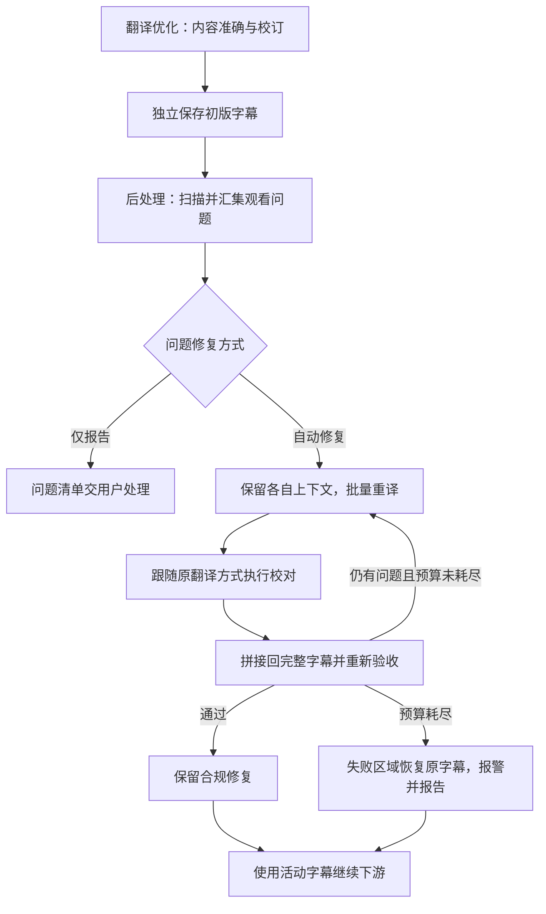

# 字幕后处理职责与限长设计记录

最后更新：2026-09-09。状态：原职责与限长设计轮次已收口；开启后处理卡顿与性能治理的新一轮 grilling。下文原轮次的实现差距和验证状态是历史记录，不代表当前代码状态；新轮次见文末。

这是本次架构讨论的持续记录，用于在上下文压缩、任务恢复或更换执行者后继续工作。
用户明确要求先记录已有决策，再继续讨论。已经写入词汇表的设计不代表运行代码已实现。

## 恢复入口

1. 先读本文的「已确认决策」「被替代的建议」「待定项」，再读取相关代码。
2. 已确认事项按用户决定推进；不要把助手曾经提出的建议恢复为默认方案。
3. 新回答到来时立即更新对应决策及待定项；发生反转时保留被替代项及原因。
4. 本次暂停点：用户已回答 Q7-Q30，核心设计 frontier 已清空；共享理解和 `run_postprocess_task` 唯一外部测试切面已确认，规格已转入 `.scratch/subtitle-postprocessing/spec.md`，9 张实施票据已发布到其 `issues/` 目录。

职责选择的长期记录见 [ADR-0020](../adr/0020-postprocessing-owns-viewing-constraints.md)。
术语见 [后处理领域词汇](../../CONTEXT.md)；本文记录决策、证据与未决问题，不替代词汇表。

## 原始问题与已验证事实

用户观察到上游设置的单行字数上限，在后处理结果中未得到保持；用户确认所述场景没有开启媒体增强对齐。

已检查本地 `The Root of The Root of All Evil` 的初版与后处理 SRT：

| 检查项 | 初版 | 后处理 |
| --- | --- | --- |
| 字幕段数 | 4013 | 4013 |
| 英文原文超过 18 词 | 0 段 | 0 段 |
| 译文按现有 count_words 超过 25 | 38 段 | 26 段 |
| 译文按现有 count_words 的最大值 | 31 | 31 |
| 译文文本字符数超过 25 | 144 段 | 114 段 |
| 译文文本字符数最大值 | 53 | 52 |
| 字数增加的段 | 不适用 | 0 段 |

该样本日志记录时间证据窗口 0、结构操作 0、语义修复 0。超长译文已经存在于初版，
后处理没有修复到上游上限；不能把这个样本的原因说成「后处理合并使字幕变长」。
尚未确认这是否就是用户最初观察的具体任务，不能将样本结论外推到全部历史任务。

另做过有无可信时间证据的对照：提供证据时，1 字与 13 字可合并成 14 字并通过速度验收；
无证据时不合并。这是另一项真实缺口，不是上述无对齐样本的归因。

代码原因已经确认：观看限长仅传给翻译前的 SubtitleSplitter；翻译按原段回写译文；
后处理配置、速度验收和保存校验没有继承对应显示长度限制。

## 已确认决策

### D01：观看约束全部归后处理

来源：用户 Q5，明确否决助手此前的「初版也应满足绝对上限」建议。

- 翻译优化专注内容准确性、语义完整性、翻译和校订。
- 翻译优化阶段移除观看用的字数上限、对应设置与处理逻辑。
- 后处理统一负责长度、换行、显示分段、阅读节奏和观看体验，以及必要的局部重译。
- 初版是完整内容成果，不承诺观看限长达标；跳过后处理就不执行这项限长。
- 渲染与合成按后处理确定的显示策略呈现；具体策略如何传递仍待设计。

基础语义分段和模型请求分批仍是需要解决的输入准备问题，不能与观看限长混为一谈。
其归属与迁移方法是待定实现方案，不能以保留这些能力为由保留上游观看限长。

### D02：每侧两种显示模式

来源：用户 Q1、Q2。

- 原文和译文分别选择「单行限长」或「不限制数值长度并允许自动换行」。
- 默认两侧均开启单行限长。
- 能表达仅译文限长、仅原文限长、两侧限长及两侧自动换行。
- 自动换行不等于关闭其他后处理能力；它不取消阅读速度和语义要求。
- 每侧独立模式如何呈现在页面上尚未定稿；额外的适用范围快捷选择不应产生互相矛盾的配置。

### D03：目标上限与绝对上限

来源：用户 Q1、Q5。

- 中英文分别设置目标长度上限和绝对长度上限。
- 目标上限是后处理尽可能遵守的软目标，允许为了语义与节奏保留较长内容。
- 绝对上限是修复结果通过长度验收的硬条件，目标上限不得高于绝对上限。
- 上限不是固定段长，不要求把短字幕补长到目标值。
- 这两项只在对应侧的单行限长模式生效。
- 失败回退可能保留超长字幕；该区域必须标明未解决，不能记为通过硬上限验收。见 D10。

### D04：采用折算字符数

来源：用户 Q3 提议半角标点权重，并在 Q4 明确接受助手的统一折算建议。

- 中日韩文字和全角标点按 1 计。
- 英文字母、数字、半角标点和空格按 0.5 计。
- 中英文阈值仍可分别设置；英文不再用「词数」衡量显示长度。
- 折算字符数是估算，不代表实际像素宽度；字体、字号、间距和可用画面宽度仍影响显示。
- 混合语言如何选择阈值、其他 Unicode 字符如何计数，尚未明确。

### D05：后处理绝对保护原文

来源：用户 Q7：「原文绝对不能改写……整个长段句子可以拆分，但是绝对不能改写」。

- 后处理以接收的原文为保护对象；可拆分长段、调整段的归属与对应时间。
- 原文的字词、标点和内容顺序保持完整，不允许删改、改述或重译原文。
- 译文允许为满足观看约束重译、校订和改写，同时保持内容准确与语义完整。
- 「两侧限长」不代表「两侧都可改写」；不保留允许后处理改写原文的开关。
- 拆分边界上的空白如何等价校验属于待定实现细节。

### D06：自动修复为默认，可选择仅报告

来源：用户 Q6。

- 默认由模型处理需要重译或语义拆分的问题字幕段。
- 用户可选择把问题段列入报告，自己处理，不发起相应模型修复。
- 该选择与整个后处理的分析模式、跳过后处理不同。

### D07：重译跟随上游翻译方式

来源：用户 Q8 第 1 点，对「统一指定两个模型」建议作出修正。

- 上游采用增强型翻译时，后处理重译也采用主翻译加高级校对的流程。
- 上游未采用增强型翻译时，重译跟随其原有翻译方式，不无条件增加高级校对。
- 待修段带上原文、已有译文、相关上下文和长度要求，允许生成一段对应多段的修复结果。
- 应参考增强型翻译的上下文组织与批量处理做法。
- 非 LLM 翻译方式如何完成受约束拆分、独立后处理如何选择流程，仍待明确。
- 复用权威术语、全文简报的具体范围是助手建议，尚未获得用户单独确认；不能记录成已经批准的全片分析或术语确认重跑。

### D08：汇集问题，保留各自上下文，批量提交

来源：用户 Q8 第 2 点，明确修正「每个问题单独发起一套请求」的方向。

- 扫描后汇集所有有问题的部分，再组织批量重译。
- 例如有 30 处超长，应携带这 30 处各自的上下文、问题与长度要求打包提交。
- 每处仍有独立问题身份与修复对应关系；批量提交不意味着混淆上下文或覆盖无关字幕。
- 用户优先要求一次批量提交；当全部上下文超过模型容量时如何分批，尚待确认。
- 问题级追踪、回退与批次级请求是不同的粒度，不能把「逐段验收」误实现为逐段串行请求。

### D09：拼接后重检，只重试剩余问题，默认 4 次业务重试

来源：用户 Q9 第 1 点。

- 将模型修复结果拼接回完整字幕，再检查字符数是否达标。
- 仍有问题时，重新收集问题段及所需上下文，批量交给重译流程。
- 已通过部分不应为了重试其他问题而重新处理。
- 修复循环持续到达标或耗尽预算；默认给 4 次业务修复重试机会，与上游同类重试规则对齐。
- 第一次提交属于正常流程，不计入重试；只有第一次提交失败后才开始计数，因此最多是 1 次正常提交加 4 次业务重试。
- 网络错误、限流等传输级重试不占用业务修复重试次数，但必须有独立的传输重试边界。
- 上游同类业务重试若当前把首次正常提交计入重试预算，也必须按此口径修正。

### D10：耗尽重试后局部回退，报警并报告

来源：用户 Q9 第 2 点，对助手此前建议的「失败便暂停自动合成」作出修正。

- 达到重试上限仍失败的区域，不保留失败的拆分结果，恢复原本未拆分的字幕。
- 其他已经成功修复的部分保留，不回滚整个任务。
- 给用户报警提示；报告明确列出多次重试仍未完成的问题。
- 回退区域是明确的未解决问题，不可静默记为字数达标。
- 「原本字幕」取后处理开始时保存的初版输入快照，不取某次未完整验收的中间结果。
- 用户已决定失败区域的回退与告警方式；完整 workflow 是否继续自动合成已由 D14 确认。

### D11：翻译输入分段与显示分段分离

来源：用户 Q10，同意建议。

- 上游保留基础语义分段和模型请求分批，但移除其中的观看长度阈值。
- 上游分段只服务内容处理和模型输入，不承诺最终显示长度、换行或阅读节奏。
- 后处理接收完整初版字幕，独立决定最终显示段、时间分配和显示侧换行策略。

### D12：修复结果支持一对多并验证原文等价

来源：用户 Q11，同意建议。

- 修复结果必须明确绑定问题身份、输出段序号、原文片段和译文片段；不能继续只用一个 cue ID 替换一段字符串。
- 一个输入段可以产生多个输出段；原文片段按顺序拼接后必须与输入原文等价，译文片段保持对应关系并接受内容与观看约束验收。
- 输出段的时间分配提示可以由模型提供，但最终时间轴仍由后处理确定性规则和时间证据约束。

### D13：按问题区域保存输入快照并局部回退

来源：用户 Q12，同意建议。

- 每个问题区域在后处理开始时保存不可变的初版输入快照。
- 该区域耗尽业务重试后，恢复为原本未拆分的字幕及时间轴；中间未完整验收的拆分结果不可作为回退依据。
- 其他已经成功修复的问题区域继续保留，不执行整片回滚。

### D14：局部修复耗尽后继续下游

来源：用户 Q14，同意建议。

- 自动修复耗尽后，完整 workflow 使用“成功修复部分加失败区域原字幕”的活动字幕继续视频合成等下游阶段。
- 告警、报告和活动字幕状态必须明确标记未解决区域；未解决区域不得被记录为通过绝对长度上限。
- 只有后处理模块级失败、初版字幕无效或用户主动停止时，才阻断下游阶段。

### D15：完整 workflow 冻结翻译执行快照

来源：用户 Q15，同意建议。

- 完整 workflow 在任务开始时冻结翻译执行快照，后处理只读复用其中的翻译方式、角色、提示词和可用上下文资产。
- 增强型翻译的修复跟随主翻译加高级校对；普通 LLM 翻译只复用普通翻译方式；非 LLM 翻译不得静默升级为 LLM。
- 独立后处理缺少翻译资产时，不猜测配置、不强制使用工具模型；只能执行确定性处理、仅报告或明确报告无法自动重译。
- 术语、简报和提示词等资产的身份与复用规则由 D23、D17 约束；具体序列化字段属于实施规格。

### D16：问题主体使用上下文边界扩展

来源：用户 Q16，本轮补充并同意建议。

- 后处理扫描得到的问题区域后，以问题区域作为修复主体，并向主体上下各扩展 X 个相邻字幕段作为边界上下文。
- 边界上下文用于保持边界位置的翻译质量，不作为默认修复目标；问题身份、主体和上下文必须在请求中分开表示。
- 批次规划沿用上游翻译的方式：先尽量保留每批主体和上下文，再缩小主体数量；单个主体仍超出 token 预算时，才逐步缩小上下文范围。
- 多个相邻问题可以共享同一段边界上下文，但结果仍按独立问题身份验收和回退。X 直接取任务快照中的上游 `boundary_context_radius`，具体 token 预算按 D26 处理。

### D17：独立后处理优先发现过程资产

来源：用户 Q17，本轮同意建议。

- 独立后处理默认在传入视频或字幕文件所在目录旁的专用过程资产目录中，检查是否存在与该输入对应的上游资产和内容。
- 资产发现优先复用上游留下的术语表、翻译审计、翻译检查点、翻译执行信息及其他已定义的上下文资产；不能仅因文件存在就无条件使用，必须验证其对应关系和可读性。
- 找不到或无法验证所需资产时，后处理先明确提示缺少哪些资产，再允许用户显式输入或选择备用资产。
- 独立调用不要求用户先按完整 workflow 运行；专用过程资产目录是常规使用方式，显式输入是备用路径。

### D18：后处理复用上游边界上下文设置

来源：用户 Q18，本轮确认。

- 后处理问题主体上下纳入的字幕段数直接读取上游已有的 `boundary_context_radius` 设置。
- 不为后处理新增第二个上下文范围设置；完整 workflow 在任务开始时冻结该设置，独立后处理使用当前任务配置或显式输入的任务快照。
- 上游当前默认值为 3；后处理沿用该值和上游的 token 预算收缩顺序。

### D19：自动换行模式跳过长度与行数约束

来源：用户 Q21，本轮确认并修正此前建议。

- 自动换行模式表示后处理不处理该显示侧的字幕段长度和行数。
- 后处理仍可执行与长度无关的阅读速度、语义质量和其他已启用观看能力；自动换行不等于跳过整个后处理模块。
- 最终换行、行数和实际渲染效果完全交给播放器或下游渲染器；后处理不为 SRT 或外部播放器提供行数、像素宽度保证。

### D20：旧观看长度配置彻底删除

来源：用户 Q22，本轮确认。

- 旧的 `max_word_count_cjk`、`max_word_count_english`、上游观看限长传递和原文改写相关配置及代码逻辑全部删除。
- 不执行旧配置迁移，不保留兼容读取；新后处理配置使用新的权威默认值。
- 上游仍保留不带观看约束的基础语义分段和请求分批机制，但不再读取旧观看长度参数。

### D21：过程资产集中存放在专用目录

来源：用户 Q23，本轮确认方向并采纳专用目录建议。

- 过程资产不直接写入视频或原字幕所在目录；软件在输入资产旁创建固定名称的 ASCII 过程根目录 `videocaptioner-workspace`。
- 过程根目录下按规范化任务名和输入资产指纹区分任务，术语表、审计、检查点、上下文快照、后处理报告和其他过程文件集中存放。
- 过程资产使用稳定命名和元数据，允许软件识别、验证和复用；文件存在本身不代表属于当前任务。
- 模块运行期间过程资产只保留在过程根目录中，用户需要时可以自行进入目录查找。
- 整个后处理模块成功完成后，才提供按 manifest 查找并复制过程资产的交付导出操作；软件不在中途提供导出，也不静默复制到普通输出目录。
- 过程根目录使用全小写、短横线分隔的名称，避免中文路径在不同操作系统中的显示和处理差异。

### D22：重叠问题合并主体并保留问题身份

来源：用户 Q24，同意建议。

- 多个问题的主体范围重叠或相邻时，合并为一个修复主体，避免同一字幕在一次请求中收到冲突修复。
- 每个问题仍保留独立的问题 ID、原因、验收状态和回退记录。
- 只有边界上下文重叠而主体不重叠时，才保持主体独立并共享请求上下文。

### D23：过程资产使用身份 manifest

来源：用户 Q25，同意建议。

- 每个任务过程目录包含 manifest，记录输入资产相对标识、输入字幕指纹、语言对、翻译方式、生成时间、软件版本和资产文件名。
- manifest 只保存身份、关系和版本元数据，不保存 API Key、完整 Prompt、模型响应或推理内容。
- 软件必须同时验证 manifest 与资产内容；文件存在本身不代表可以复用。

### D24：无媒体对齐时按负荷分配拆分时间

来源：用户 Q26，同意建议。

- 拆分单个字幕段时，按输出片段的阅读负荷比例分配原 cue 时长。
- 只允许使用规则和时间证据允许的相邻安全空隙调整边界，不跨越保护项或节奏重置点。
- 无法同时满足最短时长和语义边界时，保留原段并报告问题。

### D25：混合语言使用加权有效阈值

来源：用户 Q27，同意建议。

- 混合中英文字幕根据 CJK 与非 CJK 内容占比，在两套配置阈值之间计算有效阈值。
- 长度继续使用折算字符数；空白和零宽格式字符计 0，CJK/全角字符计 1，拉丁字母、数字和半角标点计 0.5，其他符号计 1。

### D26：沿用上游 token planner 的收缩顺序

来源：用户 Q28，同意建议。

- `boundary_context_radius` 是上游和后处理共同使用的范围设置，后处理不创建第二套设置。
- 请求超限时，先减少修复主体数量，再逐步减少边界上下文；每次收缩只影响当前请求，不修改任务快照或用户设置。
- 单个主体在零边界上下文下仍无法容纳时，明确报告 token 预算不足，不静默截断字幕内容。

### D27：每轮验收必须单调改善并防止震荡

来源：用户 Q29，同意建议。

- 每轮将候选拼回完整字幕后，重新执行结构、原文等价、语义、绝对长度和阅读速度验收。
- 只有仍未解决的问题进入下一轮，已通过的问题不再处理。
- 新候选必须消除至少一个当前问题，且不能重新引入已通过的硬约束。
- 重复候选、重复字幕指纹或无法改善的候选立即停止该问题并进入回退报告。
- 目标长度和舒适速度用于优化；绝对长度、原文等价和最低语义质量是硬门槛。

### D28：过程资产只在模块完成后导出

来源：用户 Q30，本轮确认并修正此前建议。

- 后处理模块运行期间不提供过程资产导出，过程文件留在 `videocaptioner-workspace` 中。
- 只有整个后处理模块成功完成后，才提供按 manifest 选择并复制过程资产的交付操作。
- 导出复制保留资产内容和稳定文件名，可同时复制 manifest；中途失败、取消或模块级失败不提供交付导出。

## 当前设计流程

该图不决定物理请求分批规则及时轴分配算法。

## 被替代的建议

| 旧建议或旧定义 | 当前决定 | 来源 |
| --- | --- | --- |
| 初版和后处理共同承担显示硬上限 | 观看限长只属于后处理 | Q5 |
| 固定采用拆时间段，自动换行只是例外 | 每侧可选单行限长或自动换行 | Q1、Q2 |
| 英文显示长度按词数 | 按折算字符数，英文相关字符权重 0.5 | Q4 |
| 原文默认不改，但可以开关允许改写 | 后处理绝对不能改写原文，只可拆分 | Q7 |
| 所有后处理重译都强制使用两个模型 | 跟随原翻译方式；增强型才对应增强流程 | Q8 |
| 每个问题独立发起一套重译请求 | 汇集问题及各自上下文，批量提交 | Q8 |
| 少量重试后立即交人工，例如 3 次 | 首次提交不计入重试，默认最多 4 次业务重试 | Q9、本轮 Q13 |
| 修复耗尽即停在人工处理，不交付回退结果 | 失败区域恢复原字幕并报警、报告，完整 workflow 继续下游 | Q9、本轮 Q14 |

## 待定项

当前没有待定的产品或架构决策。实施规格需要把已确认的规则转换为接口、数据结构、迁移删除清单和测试契约。

## 实现差距与已验证约束

- 上游 SubtitleSplitter 混合了词级时间戳重组、请求分批与观看限长，需要拆清职责；不应直接删除所有基础分段。
- 现有后处理 semantic repair 只携带当前显示侧文本与原 cue ID，不携带完整原译对应与翻译资产。
- 现有修复输出强制同 ID 的一对一字符串替换，不能直接表达一段重译拆成多段。
- 现有后处理默认使用工具模型配置，不会自动跟随上游增强型主翻译和高级校对角色。
- 现有后处理压缩与语义修复分别使用 `MAX_STEPS`、`max_feedback_retries` 等不同计数语义；迁移时必须明确区分初始提交、业务重试和网络级重试，并将上游同类业务重试统一为首次提交后最多 4 次重试。
- 现有「同时优化两侧」允许改写原文，与 D05 冲突；这项行为必须在实现迁移中退出。
- 现有后处理和上游仍存在旧观看长度配置及调用链；迁移时应整体删除，不做兼容迁移。
- 现有整阶段 analyze 模式不等于 D06 的「仅报告问题修复」。
- ASS 双语已有独立显示记录，但当前自动换行仍需接入每侧模式；圆角字幕两侧也会自动换行。
- SRT 不能控制播放器字体和自动换行；当前多行双语 SRT 导入还存在原译角色恢复限制。
- 当前仅有 Pillow 字宽估算可复用，不能将其宣称为任意外部播放器的绝对像素保证。
- 当前增强翻译产物仍直接写入普通输出目录；过程资产目录和 manifest 尚未实现。

## 验证与工作状态

- 初次排查完成真实 SRT 对比及有无时间证据的结构合并对照。
- 当时运行结构、速度管线、后处理线程和规范化的现有测试，共 32 项通过；这不是新设计的实现验证。
- 截至本次记录，仅修改设计文档与领域词汇，没有修改 Python 实现、用户配置或字幕成果。
- `resource/subtitle_style/ass-Nihon.json` 是用户已有工作区改动，不属于本次设计记录。
- 原可视化排查报告保留于临时目录，反映当时的候选建议；发生冲突时以本文记录的最新用户决定为准。

## 2026-09-09：后处理卡顿与性能治理（grilling 中）

### 故障输入与边界

- 复现输入：`E:\Video\Work\DHH Future of Programming\【初版字幕】DHH Future of Programming, AI, Agentic Engineering, Vibe Coding & Linux  Lex Fridman Podca-LLM 大模型翻译.srt`。
- 用户报告界面停留在「正在修复观看问题(第1轮，899个未解决)」。目前这是症状报告，不是已证明的死锁。
- 「后处理没有并行」及其与卡顿的因果关系须由代码和运行证据验证，不预设加并行就是答案。
- 不覆盖原始字幕工程；原文保护、语义质量与观看约束等既有要求不因性能治理而默认放宽。

### 本轮已确认

- P01（本轮第 1 轮回答）：只解决运行卡顿与性能、进度、取消治理；本轮不要求新增停止或重启后的断点恢复，允许重新处理。
- P02（本轮第 1 轮回答）：先建立后处理性能基准，分开测量本地开销、请求数量与耗时分布，再确定吞吐改善和响应时间指标；不承诺未经测量的整片完成时限，不以界面刷新代替真实效率改善。
- P03（2026-09-09 本会话范围确认）：治理同类长字幕的完整后处理性能，以 DHH 工程为验收样本，覆盖真实耗时、进度可见性、超时与停止响应；必要时调整共享调用层，但不扩成全应用调度重构。
- P04（2026-09-09 本会话质量确认）：保持现有质量要求和必要修复范围，不靠跳过问题、关闭必要修复、放宽验收或换低质量模型提速；允许受控并发、合理组批、减少重复计算与无效调用。既有原文保护、修复耗尽局部回退与下游门禁保持。
- P05（2026-09-09 本会话停止语义确认）：点击停止后尽快结束本地后处理任务，立即停止排队和重试，尽力中断在途请求，不等待模型自然返回；迟到响应不得写回字幕或触发下游。无法保证服务端终止已收到的请求或停止计费；不交付未完整验收的部分后处理成果，不新增断点恢复。

- P06（2026-09-09 本会话实测范围确认）：先用离线基准和模拟请求验证本地开销、并发、停止及异常路径，再用 DHH 工程固定小样本验证真实耗时和质量。真实模型请求前另行确认样本规模与费用上限；不默认授权整片重跑，grilling 阶段不发真实模型请求。

- P07（2026-09-09 本会话进度呈现确认）：后处理页面采用摘要加可展开详情。摘要显示当前阶段、批次完成数、已解决/待验收问题数和运行耗时；详情显示在途请求、等待时长、重试与限流状态。请求完成或模型返回不等于问题已经通过验收，不伪造解决进度。

- P08（2026-09-09 本会话并发上下文确认）：同一问题修复轮次采用统一修复轮次快照。主修复请求读取轮初主体和边界上下文，校对读取对应候选及明确版本的上下文，不依赖同轮邻批完成顺序；候选按固定顺序归并、重新验收，下一轮才读取归并后的新字幕。放弃同轮即时使用邻批最新修改，换取可并发与可复现语义，不放宽质量门槛。见 [ADR-0021](../adr/0021-ticket.md)。

### 本轮运行证据（只读调查，归因仍有限）

- 输入与本地状态/报告可高置信关联：DHH 初版含 7,257 个字幕段，记录 899 个未解决问题。来源为 `AppData/logs/app.log` 与输入旁 `videocaptioner-workspace` 的任务状态、QA 报告。
- `AppData/logs/llm_requests.jsonl` 的 `viewing_repair` / `viewing_repair_review` 缺少任务 ID 和文件名，只能通过时间及角色间接关联，不能当作严格任务级 trace。
- 子代理观察到长主修复请求后接多个短校对请求的串行模式；主修复耗时中位数约 163 秒，校对约 4.7 秒。已确认 40 次真实主修复、376 次真实校对跨中断重启累计：主修复分为 9、30、1 次；13:46:13 重启时回放 84 条缓存记录（9 主修复、75 校对）。不能据此推算每批主体数、899 个问题覆盖率或单次完整任务耗时；明确排除 `899/40` 这一不同口径总量相除的推算。
- 日志在 15:37:59 至 20:00:05 附近出现约 4.4 小时无请求记录空档，且缺少对应的后处理完成记录；空档原因未证实，不能仅用串行调用解释，也不能认定死锁。
- 早期两次仅报告运行各约 30 秒且缺少翻译执行快照；这只能代表当时路径，不能据此断言实际自动修复路径全部本地开销仅 30 秒。早期资产交接问题与当前分支修复有关，须避免把修复前日志直接当作当前实现的回归证据。
- 统计口径更正：500 条记录的 duration 总和约 146.1 分钟（主修复 6,778 秒、校对 1,986 秒）；三个活动子窗口为 13:05:32–13:36:01、13:46:13–15:37:59、20:00:05–20:03:54，合计约 146.0 分钟。两者近似相等支持所统计活动窗口内平均在途请求数约 1；包含静默空档的全跨度不能代表持续执行时长。撤回原报告的“平均并发约 0.35”与“墙钟 250+ 分钟”，0.35 只是累计请求耗时/约 418.2 分钟总跨度之比。
- 串行的更直接证据是记录起止时间逐条相接而非重叠：13:05:32 加 139.4 秒接 13:07:52；13:08:24 加 15.1 秒接 13:08:39；13:08:39 加 95.3 秒接 13:10:14。该结论限于已统计请求窗口，仍须通过代码报告确认当前实现；不能由此证明静默空档的成因。

### P05 代码核查补充

- 根据补充代码报告，gateway 在请求尝试边界检查取消，但阻塞的 `adapter.complete(request)` 未传入取消通道；退避使用不可中断 sleep。边界上不再发请求不等于立即退出排队、在途调用或退避等待；信号量等待是否可取消仍须核对。
- 补充报告指出修复响应返回后到候选应用之间缺少取消复查；runner 模块级取消结果使用初版并设置 `continue_downstream=False`，GUI 抑制正常完成信号，下游合成被阻断。模块级输出兜底与内部迟到结果隔离是两层要求，不能互相替代；最后一批与最后一次复校的取消竞态也需覆盖。
- 修正补充报告中的实现建议：sleep 前后增加检查不能唤醒已经发生的退避等待，需要可取消等待；`execute_batches` 的 `on_complete` 是回调入口，不等同于 checkpoint 持久化。能否复用要检查其取消、结果收集与退出行为，后处理不得照搬上游翻译的部分成果交付语义。
- 取消通道需要隔离当前任务，不能为了停止后处理而关闭仍服务其他任务的共享 client；具体机制留给实施设计，不把关闭 client 预设为唯一方案。无论是否新增断点恢复，都须在响应应用及成果交付边界防止取消后的迟到写入。

### 补齐的代码执行证据与报告纠偏

- 修复调用链：`run_postprocess_task` → `execute_viewing_repair`。`core/postprocess/repair.py:864-887` 每批主修复串行请求，`:977-996` 拼接后逐主体调用高级校对；未使用现有 `execute_batches`。因此“完全没有并行”对这条修复路径成立，但不能外推到已有批并发的上游翻译。
- `repair.py:859-863` 仅每轮批循环之前发一次进度；轮内主修复与逐主体校对不发批级进度。长时间保持“第1轮，899个未解决”不等于没有请求在完成。
- `repair.py:812` 调用 planner 时没有传 `token_budget` 或批规模参数，走 `planning.py:329-336` 默认每批至多 10 个修复主体的无预算分支。主体可能包含多个字幕段/问题，不等于 10 条字幕；D26 的容量收缩在此调用路径未启用，扩批/并发前须补齐实际请求预算。
- `repair.py:857-858` 要求按段序降序应用，以保护拆分后的索引；`:876` 构造请求读取可变 `state`，并共享尝试数与候选/区域指纹。不能直接把外层 for 换成线程池；P08 固定同轮快照和确定性归并，仍须保留稳定问题身份、局部回退和完整验收。
- gateway 已有每 profile 信号量；编排任务注入任务并发配置，独立 GUI 后处理页未注入 gateway 时走自建默认值。请求串行使既有并发上限无法带来吞吐改善；不能笼统宣称所有入口都已正确继承用户设置。
- 撤回补齐报告的“修复请求实际一律 120 秒”判断：`repair.py:756,883` 使用 `flow.main_profile.max_output_tokens`；`translation.py:317-324,385-403` 可直接取翻译快照或方案库中的角色配置，并不经过工具角色 `_stripped`。`borrow_utility_gateway` 只决定网关生命周期，不剥离模型参数。adapter 基线为 120 秒，有输出上限时按 `120 + max_output_tokens × 0.015` 缩放；SDK/HTTP 分阶段 timeout 也不能自动等同于端到端墙钟上限。实际值需按角色、请求与适配器确认。
- 撤回补齐报告中未测量的“本地亚秒”“唯一阻塞源”和乘法式最坏耗时估计；本地规划、解析、拼接、验收成本以及排队/网络/退避须分开实测。日志静默空档尚不能归因。
- 现有外部测试切面包括 `tests/test_postprocess/test_repair_execution.py` 的假网关、规划测试、runner、翻译资产交接、线程取消门禁，以及 `tests/test_llm/test_gateway.py` 的可注入 sleep/random；本轮未执行这些测试。

### 等待策略确认

- P09（2026-09-09 本会话等待边界确认）：请求有界、整片不限时。排队、网络调用及退避等待均须可取消且有明确边界，请求超时考虑输出规模、重试有界；不通过整任务总时限跳过必要修复。耗尽后显式报告，保留既有传输重试、业务修复重试与失败回退的区分。不得为赶 deadline 忽略 provider 的 Retry-After 提前重发；超出允许等待边界则明确结束该等待并进入相应失败处理。

### Grilling 收口与规格输入

- 产品决策前沿已收口，P01–P09 已整理为机器本地规格 `.scratch/subtitle-postprocessing-performance/spec.md`，下一节点为 `to-tickets`；未开始实现、性能基准或真实模型请求。
- S01（2026-09-09 to-spec 测试入口确认）：用户选择完整任务为主，复用 `run_postprocess_task` 验证初版输入到后处理结果、报告、停止及下游门禁；只在真实网关/适配器等待和 GUI/CLI 呈现处补薄层边界测试。假网关不得替代真实传输取消、SDK 重试和共享连接隔离验证。
- 实施方向：复用既有任务并发控制和每 profile 保护上限；请求层有界并发，主修复到对应高级校对的依赖保持，归并不由完成顺序决定。主修复和校对均评估按容量组批，保留独立主体身份、逐项验收和失败隔离；不把默认主体计数上限当 token 容量。
- 规格必须定义实际完整请求的输入/输出预算、主/校对角色各自容量、上下文收缩顺序、输出截断处理，以及所有 GUI/CLI/独立/编排入口的并发配置传递。具体构件复用方式、数值调优与线程/异步实现不是待用户决定的产品分支。
- P02 的基准先行作为实施依赖：先固定样本、配置、代码版本、缓存冷热状态和模拟服务延迟，分开测量本地阶段、请求数量/耗时、排队与退避、整任务墙钟及交互响应；再记录并锁定可复跑的吞吐与取消响应门槛，之后进行优化验收。不用真实服务延迟不稳定的整片耗时承诺代替受控基准。
- 必须覆盖的正确性验收：乱序完成得到相同归并结果、主体/上下文重叠及一对多拆分、局部失败与回退、原文保护和语义/观看验收、各等待阶段取消、末批/末次校对取消竞态、迟到响应不得写入或触发下游、共享网关取消隔离、重试/429/长 Retry-After/输出截断，以及任务级可关联的进度与耗时记录。
- 约 4.4 小时日志静默空档保留为未证实的故障线索：增加本地阶段、排队、请求开始/完成、退避和终态的任务级关联证据，并以故障注入验证对应等待能被识别和终止；如果历史空档仍无法复现，应明确报告未归因，不以并发加速宣称该故障已修复。
- 真实验证范围仍以 P06 为准：离线基准加经另行授权的小样本；完整 DHH 内容不写入公共仓库，也不默认授权整片付费重跑。质量不降的证据包括确定性安全回归和小样本内容质量复核，不声称仅凭模拟请求就证明模型输出质量等价。
