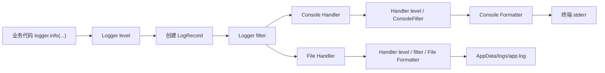
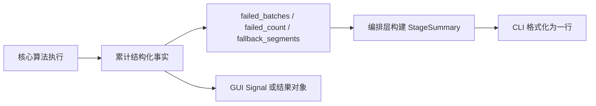

# VideoCaptioner 日志系统详解

本文面向具有本科软件工程基础、但缺少日志系统工程实践的开发者。目标是帮助读者理解：

- Python `logging` 的基本工作模型；
- VideoCaptioner 的日志文件、控制台输出和 GUI 提示为何是不同系统；
- `setup_logger()` 怎样分流、过滤、格式化和轮转日志；
- `-v`、默认模式和 `-q` 怎样改变输出；
- 提交 `462500a` 为什么引入阶段摘要和动态控制台阈值；
- 新代码应该怎样选择 DEBUG、INFO、WARNING、ERROR 和用户提示。

相关架构决策见 [ADR-0009](./adr/0009-stage-summary-driven-console-logging-separation.md)。

## 1. 最重要的总体认识

VideoCaptioner 正在把“给开发者排查问题的诊断信息”和“给最终用户看的运行状态”逐步拆成不同职责：

> Python `logging` 主要负责诊断和写入 `app.log`；CLI 与 GUI 负责进度、阶段摘要、警告和结果提示。

提交 `462500a` 的重点不是简单地“增加更多日志”，而是纠正过去两种职责混用的问题。当前仍是迁移中的混合架构：logging 的 WARNING/ERROR 默认仍可能出现在控制台，但用户摘要已不再依赖日志等级。

项目当前有四类输出：

| 类型 | 是否经过 logging | 可见性由谁控制 | 输出位置 | 敏感性 |
|---|---|---|---|---|
| Python logging | 是 | Logger、Handler、Filter 和 CLI 阈值 | `app.log`，部分也输出到终端 | 通常为诊断信息 |
| CLI 用户输出 | 否 | CLI 命令显式判断 | `stderr` 或 `stdout` | 通常较低 |
| GUI 用户输出 | 否 | Qt Signal 和页面逻辑 | Qt 界面 | 通常较低 |
| LLM 请求日志 | 否，使用独立写入器 | HTTP Hook 和请求记录器 | `llm_requests.jsonl` | 高，可能含完整用户内容 |

这四类信息可能与同一次任务有关，但它们的受众、格式、生命周期和安全要求不同。

## 2. Python logging 的基本模型

业务代码通常这样写：

```python
logger.info("后处理完成：%d 段", segment_count)
```

这不是一个简单的 `print()`。一条日志大致经过以下流程。下图表示本项目的典型配置，并不是所有 Python 项目都一定有两个 Handler：



更完整的通用顺序是：Logger level → 创建 `LogRecord` → Logger filter → 每个 Handler 各自执行 level/filter → Formatter → emit 到目标位置。Logger filter 不能阻止 `LogRecord` 的创建，因为它发生在记录创建之后。

### 2.1 Logger

Logger 是业务代码使用的日志入口：

```python
logger = setup_logger("speed.alignment")
```

之后可以调用：

```python
logger.debug("缓存未命中")
logger.info("开始处理")
logger.warning("部分窗口对齐失败")
logger.error("无法完成处理")
logger.exception("处理抛出异常")
```

项目通常为每个模块创建一个有名字的 Logger，例如：

- `speed.alignment`
- `postprocess.runner`
- `subtitle_optimizer`
- `dubbing.pipeline`

Logger 名称用于识别日志来源。

### 2.2 LogRecord

日志通过 Logger 的级别检查后，Python 会创建 `LogRecord`。它包含：

- 日志文字；
- 日志等级；
- Logger 名称；
- 时间；
- 异常堆栈；
- 通过 `extra={...}` 添加的额外字段。

后面的 Handler、Filter 和 Formatter 操作的都是这个对象。

### 2.3 Handler

Handler 决定日志发往哪里。项目中的 Logger 一般有两个 Handler：

1. `StreamHandler`：输出到控制台；
2. `RotatingFileHandler`：写入 `app.log`。

因此一条日志可能只进入文件、同时进入文件和终端，或者在 Logger 阶段就被丢弃。

### 2.4 Filter

Filter 决定某个 Handler 是否接受一条已经创建的日志。项目的控制台 Handler 使用 `ConsoleFilter`：

```python
if getattr(record, "suppress_console", False):
    return False

return record.levelno >= _console_level or bool(
    getattr(record, "console", False)
)
```

其含义是：

- `suppress_console=True`：强制不显示在控制台；
- 日志等级达到当前控制台阈值：显示；
- `console=True`：即使等级不够，也强制显示。

例如：

```python
logger.info("必须显示", extra={"console": True})
```

不过 ADR-0009 倾向于减少这种写法，因为它会再次把用户界面文案绑回日志系统。

### 2.5 Formatter

Formatter 决定最终文本的格式。当前项目对 INFO 和其他级别使用不同格式：

```python
info_fmt = "%(message)s"
default_fmt = "%(asctime)s - %(name)s - %(levelname)s - %(message)s"
```

所以 INFO 可能显示为：

```text
后处理完成：120 段
```

WARNING 则可能显示为：

```text
2026-07-18 20:30:10 - speed.alignment - WARNING - 对齐窗口失败
```

本项目自定义的控制台 Formatter 会临时清除 `LogRecord.exc_info` 和 `exc_text`，从而移除完整异常堆栈；文件 Formatter 会保留。普通 Python Formatter 并不会自动替你隐藏 traceback。因此：

```python
try:
    ...
except Exception:
    logger.exception("字幕处理失败")
```

通常会得到：

- 控制台：简短错误；
- `app.log`：错误信息和完整 traceback。

## 3. 日志等级和阈值

Python 标准日志等级对应以下数字：

| 等级 | 数字 | 推荐含义 |
|---|---:|---|
| DEBUG | 10 | 调试细节、内部步骤、自动重试 |
| INFO | 20 | 正常运行的重要阶段 |
| WARNING | 30 | 任务可以继续，但发生降级或异常情况 |
| ERROR | 40 | 某项操作失败 |
| CRITICAL | 50 | 程序整体几乎无法继续 |

数字越小，信息越详细。阈值为 WARNING 表示只接受数值大于或等于 30 的记录：

```text
DEBUG 10    不接受
INFO 20     不接受
WARNING 30  接受
ERROR 40    接受
CRITICAL 50 接受
```

需要特别注意：Logger 和 Handler 都可能进行级别或过滤检查。Logger 是第一道门；如果日志在这里被丢弃，后面的 Handler 和 Filter 根本看不到它。

## 4. 项目的 setup_logger()

核心实现位于 `videocaptioner/core/utils/logger.py`。业务模块通常这样使用：

```python
from videocaptioner.core.utils.logger import setup_logger

logger = setup_logger("postprocess.runner")
```

### 4.1 命名 Logger 和 propagate=False

```python
logger = logging.getLogger(name)
logger.propagate = False
```

`propagate=False` 表示日志不会继续传给 root logger。每个核心 Logger 使用 `setup_logger()` 配置的 Handler，而不是依赖全局 root logger。此时 `root_logger.setLevel(...)` 既不是后续门控，也不会覆盖这个命名 Logger 的等级。

这也是最近提交前 CLI 的 `-v/-q` 对核心模块不生效的原因之一。

### 4.2 日志文件位置

默认日志目录由 `videocaptioner/config.py` 定义：

```python
LOG_PATH = APPDATA_PATH / "logs"
```

开发模式下，本仓库对应：

```text
<项目根目录>\AppData\logs\app.log
```

打包或 pip 安装时，`APPDATA_PATH` 使用操作系统对应的用户数据目录，而不是程序安装目录。

### 4.3 共享文件 Handler

所有模块默认写入同一个 `app.log`。`_FILE_HANDLERS` 保证同一个进程中，每个绝对日志路径只创建一个文件 Handler。

这样可以避免：

- 同一条日志被重复写入；
- 每个模块都打开一个独立文件句柄；
- 多线程初始化 Logger 时重复创建 Handler。

`_FILE_HANDLERS_LOCK` 使用可重入锁保护 Handler 的创建过程。

### 4.4 日志轮转

`app.log` 最大为 10 MB，并保留 5 个备份：

```python
maxBytes = 10 * 1024 * 1024
backupCount = 5
```

超过限制后会形成类似文件：

```text
app.log
app.log.1
app.log.2
...
app.log.5
```

这样日志不会无限增长。

### 4.5 Windows 文件占用处理

Windows 上，如果另一个 VideoCaptioner 进程正打开 `app.log`，轮转时的重命名可能失败。项目自定义了 `_WindowsSafeRotatingFileHandler`：

- 捕获 Windows 文件共享错误；
- 不让 logging 输出内部异常堆栈；
- 继续向当前文件追加；
- 60 秒后再次尝试轮转。

这避免了日志系统自身的错误干扰用户任务。

### 4.6 压低第三方库噪音

`urllib3`、`requests`、`openai`、`httpx`、`httpcore`、`ssl` 和 `certifi` 被限制到 ERROR。否则连接池、HTTP 请求等内部信息可能淹没真正有用的应用日志。

## 5. Python logging 与 CLI/GUI 输出的区别

### 5.1 CLI 输出不经过 logging

CLI 用户输出实现在 `videocaptioner/cli/output.py`：

```python
output.info("Starting...")
output.warn("Associated media is missing")
output.success("Done")
output.error("Operation failed")
```

这些函数本质上是格式化后的 `print()`，不会经过 Logger、Handler 或 ConsoleFilter。例如：

```python
def warn(msg: str) -> None:
    print(f"! Warning: {msg}", file=sys.stderr)
```

是否输出由 CLI 自己决定：

```python
if not quiet:
    output.warn(message)
```

这意味着用户提示是否出现，不再依赖开发者把某条日志写成 INFO 还是 WARNING。

### 5.2 stdout 与 stderr 的分工

CLI 的进度、提示、警告和摘要主要写到 `stderr`。安静模式下，最终结果路径写到 `stdout`：

```python
if quiet:
    print(output_path)
```

这样脚本可以获取纯净的结果路径，而不会混入进度条和提示信息。

### 5.3 GUI 输出

GUI 使用 Qt Signal、InfoBar 和状态 Label：

- logging 写入开发者诊断信息；
- QThread 通过 Signal 报告进度、警告和完成状态；
- 页面用 InfoBar 或 Label 呈现给用户。

因此 GUI 是否显示一个警告，不应该依赖 `logger.warning()` 是否正好出现在某个终端中。

## 6. 最近提交之前的问题

提交 `462500a` 之前，CLI 大致通过下面的方式控制详细程度：

```python
logging.getLogger().setLevel(logging.DEBUG)
```

这修改的是 root logger。但是核心模块是这样配置的：

```python
logger = logging.getLogger("subtitle_optimizer")
logger.setLevel(logging.INFO)
logger.propagate = False
```

这里存在三个问题：

1. 命名 Logger 自己固定为 INFO，DEBUG 会在第一道门直接被丢弃；
2. `propagate=False`，核心日志不会交给 root logger；
3. 旧 `ConsoleFilter` 在创建时捕获固定的 WARNING 阈值，之后不能动态变化。

因此即使 CLI 把 root logger 设置为 DEBUG，核心 Logger 仍然不输出 DEBUG，`-v` 实际近似失效。

另一个问题是，开发者为了让信息显示在默认控制台，容易滥用 WARNING：

```python
logger.warning("正在重试")
logger.warning("LLM 返回格式不合格，准备再试")
logger.warning("断句失败，回退到规则模式")
```

这些事件通常能被程序自动恢复。用户最终得到正确结果，却先看到大量 WARNING，容易误以为程序不稳定。长期来看，WARNING 也失去“值得注意”的语义。

## 7. 动态控制台阈值怎样修复 -v/-q

最近提交增加了进程级共享变量：

```python
_console_level
```

以及公开函数：

```python
set_console_level(...)
```

CLI 启动后根据参数调用：

```python
if quiet:
    set_console_level(logging.ERROR)
elif verbose:
    set_console_level(logging.DEBUG)
else:
    set_console_level(logging.WARNING)
```

### 7.1 Filter 改为实时读取

新 `ConsoleFilter` 每次处理记录时都会读取 `_console_level`，不再使用创建时捕获的固定值。因此已经创建的控制台 Handler 也能响应后续变化。

### 7.2 为什么还需要 _configured_loggers

只修改 Filter 不够。假如 Logger 自己仍是 INFO，DEBUG 会在创建 `LogRecord` 前被丢弃，Filter 永远看不到它。

所以项目保存所有通过 `setup_logger()` 创建的 Logger：

```python
_configured_loggers
```

调用 `set_console_level()` 时，会重新设置这些 Logger 的等级。

### 7.3 为什么使用 min()

有效 Logger 等级计算为：

```python
min(base_level, _console_level)
```

日志数字越小越详细。Logger 必须先允许所有目标输出可能需要的最详细等级，再由各 Handler 做第二次筛选。

#### 默认模式

```text
base_level    = INFO    20
console_level = WARNING 30
Logger level  = min(20, 30) = 20
```

结果：INFO 被创建并写入文件，但被 ConsoleFilter 拦截；WARNING 同时进入文件和控制台。

#### -v

```text
base_level    = INFO  20
console_level = DEBUG 10
Logger level  = min(20, 10) = 10
```

结果：DEBUG 被创建，进入控制台；因为文件 Handler 的等级是 `NOTSET`，DEBUG 也会进入文件。

这意味着当前设计把“控制台 verbose”与“文件详细度”耦合在一起：`-v` 不仅让终端更详细，也让本次运行的 `app.log` 收到 DEBUG。如果未来希望两者完全独立，应给文件 Handler 设置单独的明确阈值，而不是只依赖 Logger 的有效等级。

#### -q

```text
base_level    = INFO  20
console_level = ERROR 40
Logger level  = min(20, 40) = 20
```

结果：INFO 和 WARNING 仍然写入文件，但控制台只显示 ERROR 及以上。安静模式不会破坏诊断日志。

### 7.4 三种模式的实际行为

| 输出 | 默认 | `-v` | `-q` |
|---|---|---|---|
| DEBUG → 控制台 | 否 | 是 | 否 |
| INFO → 控制台 | 否 | 是 | 否 |
| WARNING → 控制台 | 是 | 是 | 否 |
| ERROR → 控制台 | 是 | 是 | 是 |
| INFO → `app.log` | 是 | 是 | 是 |
| DEBUG → `app.log` | 否 | 是 | 否 |
| CLI 阶段摘要 | 是 | 是 | 否 |
| 最终结果路径 | 成功提示 | 成功提示 | stdout 纯路径 |

## 8. 为什么引入阶段摘要

新增结构位于 `videocaptioner/core/utils/stage_summary.py`：

```python
@dataclass
class StageSummary:
    stage: str
    counts: list[tuple[str, int]]
    warnings: tuple[str, ...]
    status: str | None
```

例如：

```python
StageSummary(
    stage="optimize",
    counts=[
        ("段", 120),
        ("批失败", 2),
    ],
    status="degraded",
)
```

会渲染为：

```text
optimize · 120 段 · 2 批失败 [degraded]
```

### 8.1 它比日志文本可靠在哪里

过去可能通过两行日志表达两次失败：

```text
WARNING: batch failed
WARNING: batch failed
```

现在核心模块直接维护事实：

```python
self.failed_batches = 2
```

CLI 在阶段结束后读取计数并构建摘要，不需要解析日志文本。



`StageSummary` 是一次运行中的结果传递对象，不是持久日志，也不替代异常 traceback。当前 `stage`、`status` 和计数标签仍是字符串约定；如果以后成为跨模块稳定协议，可以考虑使用 Enum、Literal 或固定字段 schema 减少拼写错误。

关键思想是：

> “发生了什么”由结构化数据表达；日志记录处理过程，不再充当业务结果的唯一事实来源。

## 9. 各阶段维护的结构化事实

### 9.1 断句

`SubtitleSplitter` 维护：

```python
rule_fallback_segments
```

它表示多少输入字幕段最终使用了规则回退：

- 整个 LLM 分块失败：按实际输入字幕段数累计；
- 部分 LLM 文本无法匹配：按局部字幕段数累计；
- 用户本来就选择纯规则模式：不算降级。

CLI 可以显示：

```text
split · 120 段 · 8 规则回退 [degraded]
```

### 9.2 优化

优化器维护：

```python
failed_batches
maxed_batches
```

- `failed_batches`：整个批次失败，保留原始文本；
- `maxed_batches`：达到最大验证次数，使用当前最佳结果。

例如：

```text
optimize · 120 段 · 1 批失败 · 2 校验未过 [degraded]
```

### 9.3 翻译

翻译器维护：

```python
failed_count
total_segments
```

例如：

```text
translate · 120 段 · 3 翻译失败 [degraded]
```

### 9.4 后处理

后处理从 `PostprocessResult` 和 `QualityReport` 中读取：

- 输出段数；
- 各规范化阶段修改数；
- 压缩失败数；
- 占位符复查数；
- 硬超速数；
- warnings；
- 是否 fallback 或 skipped；
- 对齐时间轴结果；
- HIGH、MEDIUM、LOW 证据窗口数。

## 10. 自动恢复事件为何降为 DEBUG

最近提交把一批自动恢复过程从 WARNING 降为 DEBUG。

### 10.1 LLM 限流重试

遇到 Rate Limit 后，Tenacity 会自动等待并重试。只要最终成功，它就是内部过程，因此记录为 DEBUG。

### 10.2 优化器和翻译器验证重试

典型 agent loop 是：

```text
调用 LLM
→ 验证结果
→ 不合格
→ 把错误反馈给 LLM
→ 再次尝试
```

中间验证失败属于 DEBUG。只有最终结果出现用户可感知的质量下降，例如整个批次失败并保留原文，才应进入结构化降级；是否同时记 WARNING 要看用户或运维是否需要立即注意，而不是“只要发生过异常就警告”。

### 10.3 断句规则回退

LLM 断句无法匹配某段 ASR 时，程序用确定性规则处理。内部匹配细节记录为 DEBUG，实际回退段数进入 `rule_fallback_segments`，由阶段摘要稳定呈现。

## 11. 对齐时间轴的可见结果

媒体增强对齐可能产生三种结果：

```text
applied
degraded_no_media
degraded_failed
```

### 11.1 applied

至少有一个窗口取得了媒体生成的时间证据，同时可以显示 HIGH、MEDIUM、LOW 证据数量。

### 11.2 degraded_no_media

用户启用了媒体增强对齐，但没有可用媒体。后处理继续使用字幕内部时间，CLI 不因缺少可选媒体而让整个任务失败。

### 11.3 degraded_failed

媒体存在，但对齐器没有成功生成任何媒体时间证据。

对齐器失败时仍会构造 LOW 级字幕时间回退窗口，因此不能只用 `if evidence` 判断成功。当前实现检查：

```python
window.quality_metrics["fallback"]
```

只有至少一个非回退窗口时才是 `applied`；全部为字幕回退窗口时是 `degraded_failed`，并且不会保存无效 timing sidecar。

## 12. CLI 摘要和 logging 的关系

字幕命令结束前大致执行：

```python
progress.finish()

for stage_summary in stage_summaries:
    output.stage(stage_summary)

output.success("Done -> ...")
```

`output.stage()` 不是 `logger.info()`，所以摘要不会受到 logging 阈值意外影响。安静模式则由 CLI 明确决定不渲染：

```python
if not quiet:
    output.stage(...)
```

用户能否看到任务摘要，是前端层的明确决策，而不是日志等级的副作用。

## 13. 最近提交新增的 INFO 覆盖

### 13.1 配音

现在会记录：

- 配音开始；
- 字幕段数、provider 和 voice；
- 重写和合成数量；
- 加速段数；
- 最终音频、视频路径。

### 13.2 速度优化

现在会记录：

- cue 数、主字幕侧和 profile；
- apply/analyze 模式；
- 时间证据窗口数；
- 边界移动、结构操作和未解决超速数量。

### 13.3 媒体对齐

现在会记录：

- 对齐窗口计划数量；
- 语言、音轨和模型；
- 缓存是否命中；
- 失败与回退窗口；
- HIGH、MEDIUM、LOW 数量。

### 13.4 后处理

现在会记录：

- 输入段数、布局和置信度；
- 是否跳过或进入分析模式；
- 是否回退；
- 最终输出路径。

这些 INFO 默认主要进入 `app.log`，不会污染普通 CLI 控制台。

## 14. GUI 怎样消费结构化结果

GUI 当前没有完全依赖通用 `StageSummary`，实际流程更接近：

```text
core 返回 PostprocessResult
→ QThread 发出 progress/warning/finished Signal
→ 页面读取结果对象
→ 更新状态 Label 和 InfoBar
```

对齐结果会持久显示为：

```text
对齐时间轴：已应用（HIGH 5/LOW 2）
```

或者：

```text
对齐时间轴：已降级（未关联媒体）
对齐时间轴：已降级（对齐失败）
```

持久标签比几秒后消失的警告更适合表达“本次结果最终使用了什么能力”。

## 15. 独立的 LLM 请求日志

除 `app.log` 外，项目还有：

```text
AppData/logs/llm_requests.jsonl
```

它由 `videocaptioner/core/llm/request_logger.py` 直接写入，不经过 `setup_logger()`。

### 15.1 JSONL 格式

JSON Lines 表示每一行都是独立 JSON：

```json
{"time":"...","task_id":"...","request":{},"response":{}}
{"time":"...","task_id":"...","request":{},"response":{}}
```

这种格式适合逐行追加、增量读取和 GUI 文件监视。

### 15.2 请求捕获过程

OpenAI Client 使用带 HTTPX Hooks 的自定义 Client。请求发送前记录：

- URL；
- 请求 JSON；
- 开始时间。

响应到达后补充：

- HTTP 状态码；
- 耗时。

SDK 解析响应后，再写入完整响应内容。

### 15.3 任务上下文

LLM 日志还会附带：

```text
task_id
file_name
stage
```

上下文由 `videocaptioner/core/llm/context.py` 管理。它使用加锁的模块级变量，而不是 `contextvars`，因为项目大量使用 `ThreadPoolExecutor`，线程池不会自动复制 context variable。

锁只能保证读写这个全局变量时不会发生数据竞争，不能保证多个并发顶层任务各自拥有正确上下文。如果两个任务同时运行，后设置的上下文可能覆盖先设置的上下文。这是当前实现的已知限制，而不是 `contextvars` 的完全等价替代方案。

### 15.4 轮转和失败策略

LLM 日志达到 10 MB 后保留一个旧文件：

```text
llm_requests.jsonl
llm_requests.jsonl.old
```

写日志异常会被吞掉，避免日志系统破坏主任务。代价是日志写入失败本身不会继续抛出。

### 15.5 安全注意

该文件可能包含完整的 Prompt、字幕文本、LLM 返回内容和模型参数。当前实现序列化 URL、请求 JSON 和 SDK 响应，不序列化 HTTP headers，因此 Authorization header/API key 通常不会被该记录器写入；但 URL 查询参数和请求正文仍应视为敏感数据。不要把文件提交到 Git、上传到公开 issue 或随意发送给他人。

## 16. 当前架构仍处于渐进迁移阶段

ADR-0009 的方向是“控制台由前端拥有、日志只管文件”，但当前实现仍是渐进式混合状态：

- 默认 WARNING/ERROR 仍可能由 logging 输出到控制台；
- `-v` 会把 DEBUG/INFO logging 输出到控制台；
- 通用 `StageSummary` 目前主要用于 CLI 字幕和后处理命令；
- 配音、速度等模块主要补充了 INFO 日志，尚未全部返回统一摘要；
- GUI 主要使用结果对象和 Qt Signal，而不是直接使用通用 `StageSummary`。

因此更准确的描述是：最近提交建立了职责边界和迁移方向，但没有一次性把所有模块改造成同一种报告协议。

另外还有几个值得了解的现状：

- INFO 使用纯消息格式，在 `app.log` 中没有时间和 Logger 名称，这会削弱跨模块、并发任务和时序问题的诊断能力；当前是为了简洁而保留的现状，后续可考虑让文件端始终使用完整格式；
- `-v` 会让 DEBUG 同时进入控制台和 `app.log`；
- LLM 任务上下文是单个进程级当前上下文，并发执行多个顶层任务时需要留意归属问题；
- `extra={"console": True}` 可以绕过普通控制台阈值，应谨慎使用。

## 17. 新代码应该怎样选择输出方式

### 17.1 用户每次运行都必须看到

例如：

- 输出文件路径；
- 阶段最终处理了多少段；
- 是否降级；
- 是否应用媒体对齐。

应使用 CLI `output.*`、GUI Signal/InfoBar/Label，以及结构化结果或 `StageSummary`。不要只使用 `logger.info()`。

### 17.2 只在排查问题时需要

例如：

- 命中了哪个缓存；
- 某个内部匹配比例；
- 某次重试的错误原因。

应使用 logging。

### 17.3 推荐等级

自动恢复中的临时失败使用 DEBUG：

```python
logger.debug("第 %d 次验证失败，准备重试: %s", attempt, reason)
```

正常阶段开始和结束使用 INFO：

```python
logger.info("语速优化开始：%d 段", count)
logger.info("语速优化完成：修改 %d 段", changed)
```

任务仍能完成但最终结果出现用户或运维需要关注的质量下降时，才使用 WARNING，并同时记录结构化降级事实：

```python
logger.warning("对齐窗口失败，使用字幕时间")
fallback_count += segment_count
```

操作无法完成时使用 ERROR：

```python
logger.error("音频提取失败")
```

在 `except` 中需要 traceback 时使用 `logger.exception()`：

```python
try:
    run_aligner()
except Exception:
    logger.exception("对齐器执行失败")
```

### 17.4 推荐的模块写法

```python
from videocaptioner.core.utils.logger import setup_logger

logger = setup_logger("my.module")


def process(items):
    logger.info("处理开始：items=%d", len(items))

    failed = 0

    for item in items:
        try:
            logger.debug("正在处理 item=%s", item.id)
            process_one(item)
        except RecoverableError as exc:
            failed += 1
            logger.warning("item=%s 已降级处理：%s", item.id, exc)
        except Exception:
            logger.exception("item=%s 处理失败", item.id)
            raise

    logger.info("处理结束：items=%d failed=%d", len(items), failed)

    return ProcessResult(
        item_count=len(items),
        failed_count=failed,
    )
```

CLI 再根据 `ProcessResult` 构建用户摘要，而不是解析日志文本。

推荐使用 logging 的惰性格式化：

```python
logger.info("处理文件：%s", path)
```

而不是：

```python
logger.info(f"处理文件：{path}")
```

前一种写法在该日志等级未启用时，不需要提前构造完整字符串。

## 18. 常用排查流程

遇到问题时，可以按以下顺序排查：

1. 先正常运行，观察用户摘要和真正的 WARNING/ERROR；
2. 使用 `-v` 重现，观察 DEBUG 细节；
3. 查看 `AppData/logs/app.log` 中的阶段开始、结束和 traceback；
4. 如果问题与 LLM 内容或接口响应有关，查看 `llm_requests.jsonl`；
5. 根据 `task_id`、`file_name` 和 `stage` 关联请求；
6. 分享日志前删除 API 密钥、字幕内容、Prompt 和其他敏感信息。

## 19. 总结

提交前，哪些信息能被用户看到，很大程度上取决于开发者把日志写成 INFO 还是 WARNING；核心命名 Logger 又因为 `propagate=False` 和固定 INFO 阈值，无法响应 CLI 的 `-v/-q`。

提交后：

- 共享的动态控制台阈值让 `-v/-q` 真正生效；
- 文件日志在安静模式下仍保留 INFO/WARNING；
- 自动恢复过程降为 DEBUG；
- 核心模块累计结构化事实；
- CLI/GUI 根据结构化结果决定用户看到什么；
- `StageSummary` 稳定表达每个阶段的最终结果；
- `app.log` 和 `llm_requests.jsonl` 分别承担一般诊断与 LLM 请求追踪。后者不是具备防篡改、完整性保证和可靠落盘承诺的严格审计日志。

最重要的工程原则是：

> 核心模块提供结构化事实，CLI/GUI 负责向用户表达，logging 负责记录内部过程和诊断信息。
